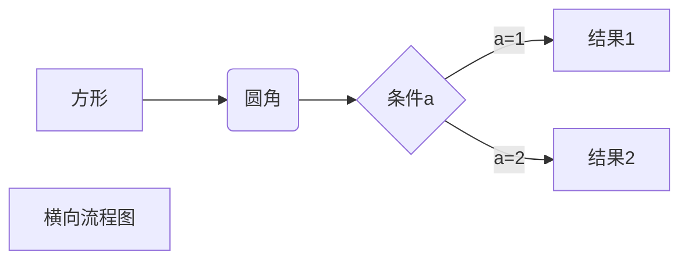

\title{title}

<h1 style="font-size: xxx-large;">title</h1>

-1	\part{part}

# part

0	\chapter{chapter}

## chapter

1	\section{section}

### section

2	\subsection{subsection}

#### section

3	\subsubsection{subsubsection}

##### section

4	\paragraph{paragraph}

###### section

5	\subparagraph{subparagraph}

<h6 style="font-size: smaller;">section</h6>

\tableofcontents

[TOC]

\label{label}

{#label}

Here's a simple footnote,[^1] and here's a longer one.[^bignote]

[^1]: This is the first footnote.

[^bignote]: Here's one with multiple paragraphs and code.

    Indent paragraphs to include them in the footnote.
    
    `{ my code }`
    
    Add as many paragraphs as you like.




在$\mathbb{R}^1$中建立一维坐标系，向量$\overrightarrow{OA}$的有向长度就是点$A$的坐标．

```
\begin{center}\begin{picture}(80,10)
\put(0,0){\line(1,0){80}}
\put(20,0){\circle*{3}}
\put(60,0){\circle*{3}}
\put(20,8){\makebox(0,0){$O$}}
\put(60,8){\makebox(0,0){$A$}}
\end{picture}\end{center}
```

<svg width="80" height="35">
    <rect x="0" y="25" width="80" height="1"/>
    <circle cx="20" cy="25" r="3"/>
    <circle cx="60" cy="25" r="3"/>
    <text x="20" y="17">O</text>
    <text x="60" y="17">A</text>
</svg>

+ Create a list by starting a line with `+`, `-`, or `*`
+ Sub-lists are made by indenting 2 spaces:
  - Marker character change forces new list start:
    * Ac tristique libero volutpat at
    + Facilisis in pretium nisl aliquet
    
    - Nulla volutpat aliquam velit
+ Very easy!